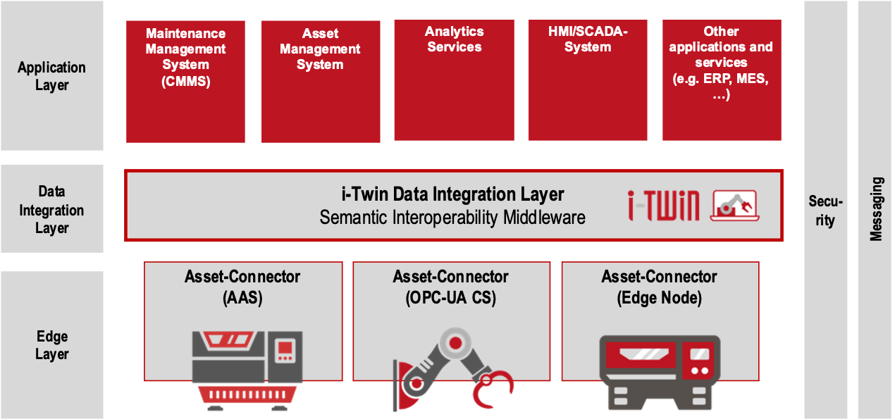
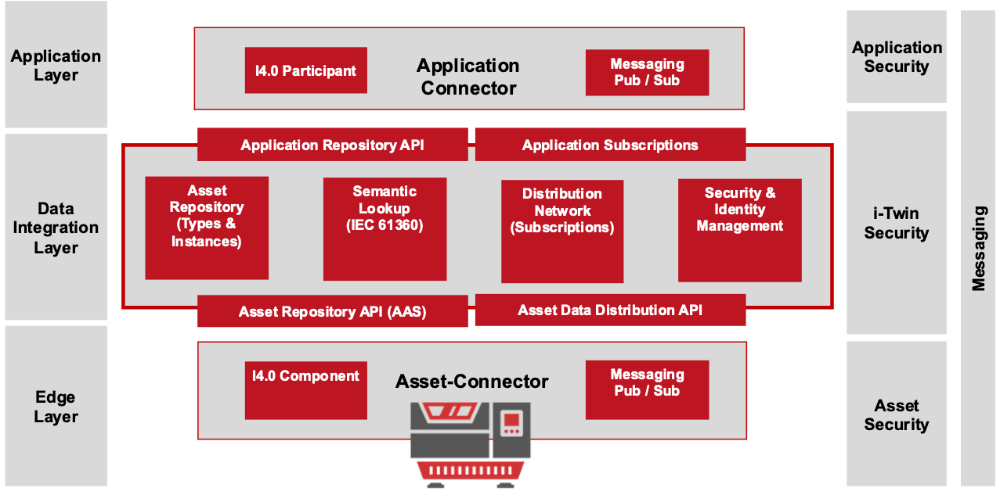

# Introduction

The [i-Asset Repository](https://github.com/i-Asset/asset-repository/) is a collection of software modules which together build the i-Asset Platform. 

## i-Asset Platform

The i-Asset Platform builds on existing standards such as the [Asset Administration Shell](https://www.plattform-i40.de/PI40/Redaktion/DE/Downloads/Publikation/Details_of_the_Asset_Administration_Shell_Part1_V3.html) Meta-Model and provides the infrastructure for Industry 4.0 Scenarios.

Figure 1: i-Asset Platform Conceptual Archtitecture

Participating applications, such as CMMS, Analytic Services, SCADA Systems and others should be in a position to communicate with each other, read from assets and so on. For achieving this, the i-Asset Platform proposes the usage of the AAS Meta-Model for the description of the exposed functionality. This transforms each of the application into a I4.0 component.

As shown in Figure 1, the i-Asset Repository proposes a Data Integration Layer which connects Applications and Assets seamlessly. Each of the Applications and Assets are equipped with a dedicated connector exposing their functionality and data as AAS.

Figure 1: Data Integration Layer

## Project Structure

The main project contains several modules:

- `asset-repository` Maven parent module that contains the components used in the i-Asset Platform
- `asset-repository-service` Spring-Boot Service. This central service provides the Asset Administration Shell Repository Services as specified in [Asset Administration Shell - Part2](https://www.plattform-i40.de/IP/Redaktion/DE/Downloads/Publikation/Details_of_the_Asset_Administration_Shell_Part_2_V1.html).
- `asset-repository-api` Common module holding Utility classes, Interfaces used with the `asset-repository-service` and `asset-connector`.
- `asset-repository-mongo` Persistence for the `asset-repository-service`
- `semantic-lookup-service` IEC 61360 compatible taxonomy service
- `semantic-lookup-api` Common module holding Interfaces for the `semantic-lookup-service`
- `asset-connector` The runtime component for assets and applications 

### Dependecies

Required dependencies in the project are

- `aas4j-model-generator` forked from [AAS4J Model Generator](https://github.com/eclipse-aas4j/aas4j-model-generator) This project is used to generate the AAS-Model
- `aas4j` forked from [AAS4J](https://github.com/eclipse-aas4j/aas4j)

please refer to the [Readme](../../README.md) for installation and first use

## Connector

The connector represents the runtime environment for (one or more) Asset Administration Shells. According to the specification, the connector exposes a HTTP-REST endpoint which allows other participants to obtain data from the connector and in turn from the wrapped asset/or application. 
Furthermore, the connector establishes the asynchronous communication with a configured messaging broker (Kafka, MQTT) based on the `BasicEventElement`s in his AAS environment. 
