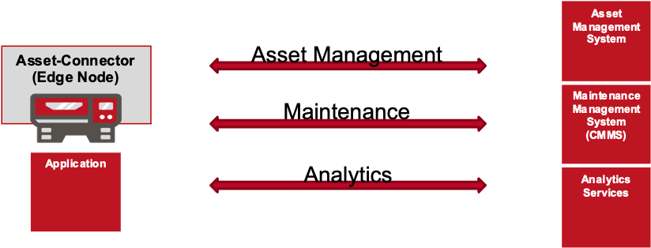
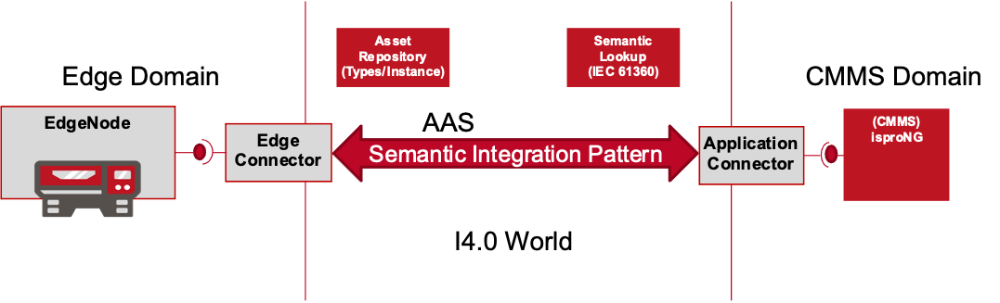

## Semantic Integration Pattern

A Semantic Integration Pattern provides predefined access points for communication needs to Applications and Assets. Typically the assets and the connected applications fulfil particular needs. For this, especially the applications provide common, domain specific functionality. Figure 1 outlines this communication requirements to address the requested functionality and data.

Figure 1: Communication Requirements

In traditional systems, for example a machine on the shop floor wants to create a maintenance request in the company's CMMS system. For this, it is required to know in advance

- which CMMS sytem is in use
- how to connect with the CMMS
- the proprietary definition of the maintenance request
- how to identify itself with the CMMS

Moreover, in most cases it is not possible to issue a maintenance request directly, instead the operator of the machine will have to open a web- or mobile-interface, search for the asset in the CMMS and finally provide the information in the approprate interface of the CMMS.

Semantic Integration Patterns address this problem and aim overcome this obstacle with predefined communication paths, which may be used by assets and applications to realise their needs. The Meta-Model for the Asset Administration Shell is used for describing assets and their functionality on one hand but also for a concrete description of the data objects required in each of the communication paths.

Figure 2: Common Data Model and Interfaces

Figure 2 outlines the paradigm. Instead of individual interfaces we propose the use of AAS for both, the description of the data objects and also for the definition of available communication paths. Each of the participating application or asset is transformed into a Industry 4.0 Component which services its own `AssetAdministrationShell`. This particular Industry 4.0 Component is referred to as Connector since it connects the asset or application with the outer I4.0 world.

### SIP's a Characterization

We would like to characterize a Semantic Integration Pattern as follows:

- A SIP provides predefined communication channels for assets and applications
- They are defined based on the AAS-Elements for synchronous (`Operation`) and asynchronous (`EventElement`) communication. SIP's also take external semantic definitions such as ECLASS into account. The i-Asset Platform uses the `semantic-lookup-service`for this.
- The define the exchanged data, e.g. the messaging payload for events and input/output variable for method invocations
- SIP's are `extensible`. They are managed with the `asset-repository-service` which in turn uses the IEC 61360 compatible `semantic-lookup-service` for semantic annotations of Commodity Classes and their Properties. Both data models (AAS, IEC 61360) support inheritance, therefore it is possible to define data objects and to refine them for special needs. The AAS Meta-Model supports the integration of IEC 61360 data with `HasDataspecification`! 
- SIP's are assumed to be `complete`. The external (IEC 61360) information is mapped into the AAS Meta-Model, a SIP contains the semantic definiton of each data, furthermore it defines the AAS-Structure of semantically enriched data objects and also the communication definition.  
- SIP's are `exchangeable`. The AAS model may be imported and exported by means of the AASX Package format.
- SIP's `adhere to standards`. The AAS meta-model not only provides the AAS Elements (`Operation`, `EventElement`, `SubmodelElementCollection`, `Property`etc.), it also defines a reduced `ValueOnly` representation of AAS models. This reduced representation is the foundation for the data exchange and the connectivity into connected asset and applications.

Overall, it must be possible to detect a Semantic Integration Pattern in a system. This can be ensured with AAS Submodel and SubmodelElement with `HasKind.TEMPLATE`. A SIP must be extensible - for this it is required to specify the inheritance

### How to create a Semantic Integration Pattern

The creation/definition of Semantic Integration Patterns 

